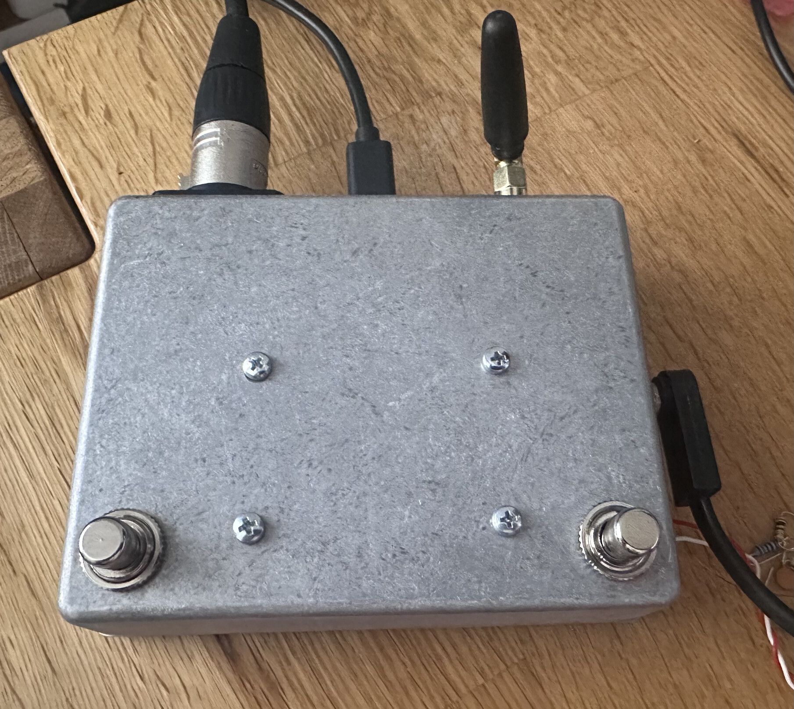
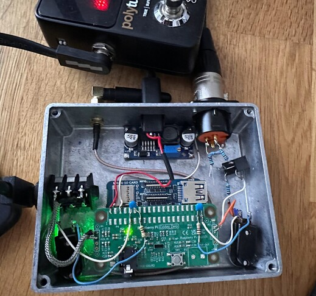
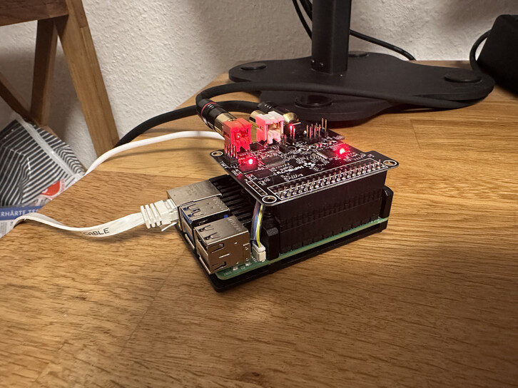
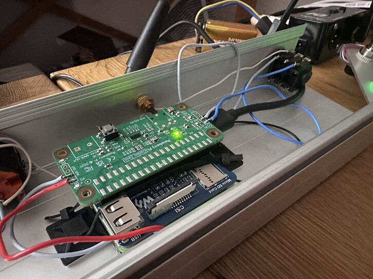
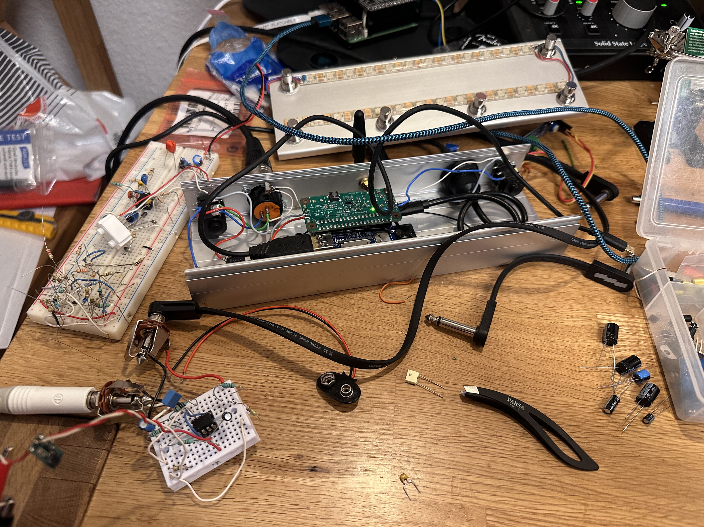

# Raspberry Pi (CM4/CM5) + Codec Zero Guitar Pedal (Transformer XLR Out)

DIY guitar pedal based on a **Raspberry Pi Compute Module (CM4 or CM5)** and **Audio Codec Zero**.
Audio output is designed for **mixer MIC input** via an **output transformer wit -20 dB PAD**.




## Motivation

There are many guitar multi-effect pedals out there. Most of them are using proprietary SW and formats and lock the customer
into their ecosystems. What happens when the company decides to stop supporting the pedal you bought? What if you want to 
use your device support different formats?

My main drivers are:
 - have an easy to build/extend guitar pedal,
 - built with open source hardware and software.

Today, the open source Neural Amp Models are becoming a standard that can easily compete with the industry leaders.
Free to download captures/models are available at [Tone3000](https://www.tone3000.com/) and the numbers are growing every day.
There is no more a reason to get yourself locked into an proprietary ecosystem.

Guitar pedal / processor that plugs straight into **Mixer MIC input via XLR**. Of course it could be easily extended to provide
different input/output possibilities. And lastly, having to create captures would be a nice feature too.

## Demo

[](https://drive.google.com/file/d/1NuAQOIKmJrkCax1FqkEEcGqWqiNP_ioW/view?usp=sharing)

The model used is a 5150 from https://www.tone3000.com/tones/evh-5150-6440

## Software
The pedal is running [PiPedal](https://github.com/rerdavies/pipedal). Another option would be [MOD.audio](MOD.audio).

---

## Hardware Signal Flow

Guitar → Buffer → ADC → Raspberry Pi DSP → DAC → **PAD (-20 dB)** → **Transformer** → XLR → Mixer MIC IN

PiPedal works well with many USB Audio Interfaces. For an embedded application, the Raspberry Pi CM5 and a Raspberry Pi Codec Zero has been selected.

The Codec Zero has a Line Level input output. To connect the guitar directly to the Aux IN, a buffer circuit is needed. Great results gives the 
Polytune guitar tuner whith one of the best buffer circuits out there.

To have a buffer circuit inside the pedal, a great results shows the Kliche Buffer (https://www.musikding.de/Kliche-Buffer-kit). This should be however
extended by an output volume control to tune the signal going to ADC to prevent clipping.

---

## Parts List (BOM)

## Core
- Raspberry Pi **CM4 or CM5**
- carrier board (with 40-pin header access) - [CM4-NANO-A](https://www.waveshare.com/wiki/CM4-NANO-A) or [CM5-NANO-A](https://www.waveshare.com/wiki/CM5-NANO-A)
- [Audio Codec Zero](https://www.raspberrypi.com/documentation/accessories/audio.html#raspberry-pi-codec-zero) board (I2S audio). Other options are HifiBerry DAC+ ADC Pro (a bit bigger form factor)

## Input (Guitar) + Buffer

The Signal path consists of many parts. It is important to tune the gain staging between all of them. Especially the Buffer → ADC is the most crucial one. If the gain is too small, the NAM won't saturate enough. If the signal is too high, the ADC will start clipping. The buffer should ideally have variable gain.

Electric guitar can peak very high. The OpAmp gain could stay 1 (no gain). To prevent ADC clipping a volume regulation should be placed right after the OpAmp and the coupling output capacitor.

Recommended
  - TC Electronic Polytune
  - [Kliche Buffer](https://www.musikding.de/Kliche-Buffer-kit)

Feel free to use a different buffer or build a buffer circuit yourself.

Volume control at the end of the buffer to compensate for different guitar pickup outputs
```
TL072 OUT ---[1k]---o-----> upper side of the pot (A10k log)
                    |
                 [  POT  ]
                    |
GND ----------------o-----> lower side pot

wiper (pot middle) ---||---o----> AUX IN (Codec Zero)
                     10uF  |
                         [100k]
                           |
                          GND
```

## Footswitches
- momentary footswitch (soft-touch recommended)
- Optional debounce parts per switch:
  - 10k pull-up (if not using internal pull-up)
  - 100nF to GND (RC debounce)

## Output to Mixer MIC IN (XLR)
- 1× output transformer (line → mic)
  - 1:1 or step-down (depends on model; 1:1 is OK if pad exists)
  - great options are Lehle MZ and Neutrik NTL1
- XLR female panel connector
- Pad resistors for **-20 dB balanced pad**
- 2× 47–100 Ω series resistors on codec output (optional but recommended for stability)

## Power
- 5 V supply for CM carrier + codec
- If running op-amps at higher rails (example 24 V):
  - DC/DC boost module
  - extra filtering caps
  - careful grounding

## XLR out
## Jack in
## Diecast aluminium enclosure

The Raspberry Pi needs quite intensive cooling. Attaching it directly to the diecast aluminium enclosure with heatsink pads does the job pretty well.

---

## Output: Mixer MIC Input via Transformer

A mixer mic input is sensitive (Mic level 1.5kΩ -5kΩ). Codec line out is strong (can drive 10kΩ loads easily)
You need both:

1) **-20 dB pad** (the resistor values depend on the impedances of output transformer and the mixpult input)
2) **output transformer isolation** (Lehle MZ or Neutrik NTL1)

```
NTE1 sec ---[1k5]----- XLR pin2
                   |
                 [330]
                   |
NTE1 sec ---[1k5]---- XLR pin3

XLR pin1 -> ground/enclosure
```

# Configuration

# ALSA

```
$ sudo alsactl restore -f config/codec-zero-left.conf
```

# Working on different prototypes




